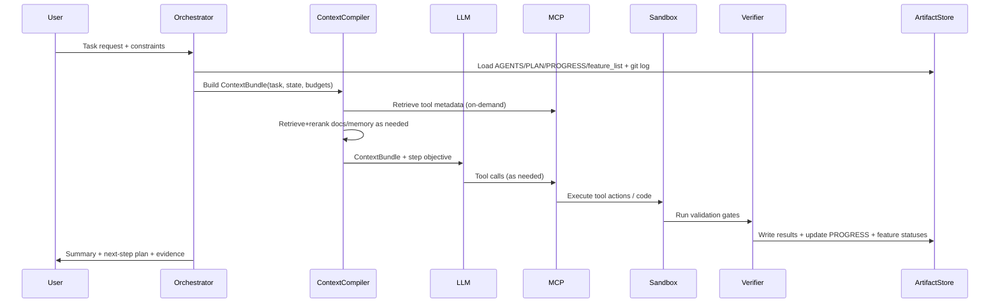
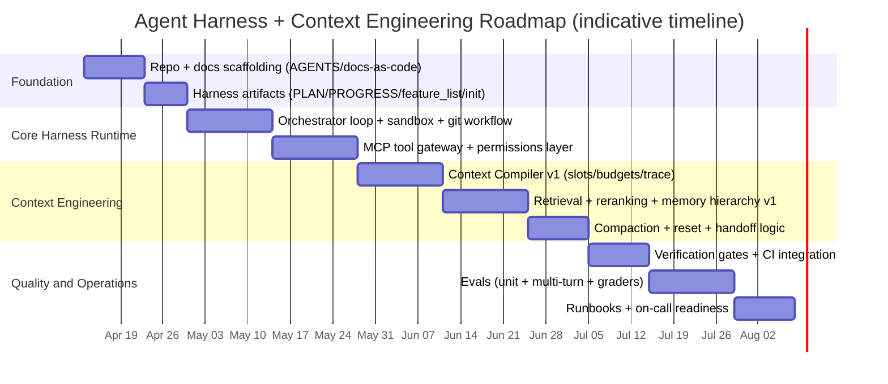

# Production-Grade Agent Harness and Context Engineering System with Technical Documentation Architecture

## Executive Summary

This report specifies a **production-grade Agent Harness + Context Engineering system** and the **technical documentation architecture** required to build and operate it. **All documents described here are technical documents** (SAD/TDD/ADR/API specs/runbooks plus harness artifacts) designed so engineers can **implement directly** rather than interpret high-level prose. citeturn18search3turn2search1turn2search0turn2search2turn2search3turn9view0turn10view0turn8view0

Core research conclusions:

- Long-running agents fail when work spans multiple sessions because each session begins without memory; the harness must bridge sessions using **durable artifacts** (plans, progress logs, feature lists, repo history) and disciplined verification loops. citeturn9view0turn12view1turn16view0turn8view0  
- “Context Engineering” is the systematic practice of selecting and curating tokens at inference time (system instructions, tools, external data, message history, etc.), because context is **finite** and can degrade (“context rot”) as it grows. citeturn9view1turn10view3turn10view0  
- Production harnesses converge on: (a) **externalized state**, (b) **incremental progress** and “clean state” endings, (c) **verification gates** at milestones, (d) tool governance + token efficiency, and (e) **entropy control** via mechanical checks and doc-gardening. citeturn12view1turn16view1turn14view0turn14view2turn8view0  
- For tool ecosystems, standardize integration via **Model Context Protocol (MCP)** (JSON-RPC 2.0, capability negotiation; servers expose resources/prompts/tools; built-in security principles). citeturn13view0turn13view1turn13view3  
- For long-horizon quality, use an **Evaluator agent** pattern (separate from the Generator) because self-evaluation is unreliable; evaluator-driven iteration provides measurable lift, especially near model capability boundaries. citeturn11view0turn11view2  

Unspecified inputs (must be decided by your team): target cloud/provider, execution substrate (Kubernetes vs serverless vs bare-metal), database/vector store selection, and model vendor(s). This report provides technical options and contracts that remain valid across those choices. citeturn2search1turn8view0turn13view0  

## Scope, Audience, and Non-Goals

### Scope

This report covers:

- A reference architecture for a long-running, tool-using agent system (“Agent Harness”) with a formal **Context Compiler** and **Memory hierarchy**.
- Concrete implementation contracts and schemas (context slots/token budgets, memory record schemas, MCP tool schema examples, retrieval+rereanking, compaction vs reset rules, verification gates).
- A technical documentation architecture (SAD/TDD/ADR/OpenAPI/runbooks) with required front-matter and templates.
- Repo layout + docs-as-code workflow using merge requests and version control.
- Harness artifacts and examples: `AGENTS.md`, `PLAN.md`, `PROGRESS.md`, `feature_list.json`, `init.sh`.
- Evaluation strategy and operations guidance (runbooks, incident scenarios, delivery checklist, sprint-ready tasks, and a roadmap timeline). citeturn9view0turn10view0turn8view0turn17view0turn3search4  

### Audience

Staff/FAANG-level engineers and tech leads implementing systems that must be:

- reliable across multi-session runs,
- inspectable and reviewable via artifacts,
- tool-governed and safe,
- continuously verified and regression-tested,
- operable (on-call/runbook-ready). citeturn12view1turn16view1turn3search4turn17view2  

### Non-goals

- Not a model benchmark report, and not a “best model” recommendation (harness design assumptions go stale as models improve). citeturn11view2turn8view0  
- Not a vendor-specific cloud deployment guide (cloud is unspecified; options provided).
- Not a “prompt-only” approach: the goal is a **system** (artifacts, tooling, enforcement), not prompt folklore. citeturn8view0turn9view1  

## Conceptual Foundations and Failure Modes

### Definitions that drive implementation

**Agent Harness Engineering** is the discipline of designing the scaffolding around an agent—context delivery, tool interfaces, planning artifacts, verification loops, memory/state systems, and sandboxes—that determines success on real tasks. citeturn6view0turn8view0turn16view0  

**Context Engineering** is the set of strategies for curating and maintaining the optimal tokens (information) provided during inference, beyond the system prompt (tools, external data, history, etc.). The engineering objective is to maximize outcome reliability within finite context constraints. citeturn9view1turn10view3  

**Long-running agent problem**: agents work in discrete sessions; each new session begins with no memory, so continuity must be achieved by durable external state and disciplined handoffs. citeturn9view0turn12view1  

### Failure modes you must explicitly design against

These are not theoretical; they appear repeatedly in frontier harness reports:

- **One-shotting / over-scoping**: agent tries to implement too much; runs out of context mid-implementation; next session restarts into a half-broken state. citeturn12view1turn9view0  
- **Premature “done”**: agent sees partial progress and declares victory without full end-to-end functionality. citeturn12view1turn12view0  
- **Verification bypass**: agent marks features complete without real end-to-end tests; requires explicit gates and tooling. citeturn12view1turn16view1  
- **Context rot / attention dilution**: as context grows, models can lose focus and retrieval precision degrades; treat context as finite with diminishing returns. citeturn10view3turn9view1  
- **Context anxiety**: near perceived context limit, models can wrap up prematurely; **context resets + structured handoffs** may be required. citeturn11view0turn11view3  
- **Tool overload**: tool definitions/results can consume tens of thousands of tokens before the task even starts; wrong tool selection and wrong parameters become common. citeturn14view2turn14view1  
- **Self-evaluation failure**: agents tend to praise their own outputs; evaluator separation is more tractable than making a generator self-critical. citeturn11view0turn11view2  
- **Documentation drift / entropy**: if knowledge is not mechanically checked, monolithic instruction files rot, cannot be verified, and become harmful; production harnesses enforce structure and run recurring “doc-gardening.” citeturn8view0turn16view1  

## Reference Architecture

### Component model

This architecture is designed to encode the “durable project memory” and “map-not-manual” principles: a short agent entrypoint plus versioned deep docs as system-of-record. citeturn8view0turn16view0turn17view0  

```mermaid
flowchart LR
  U[User/Operator] -->|Task + constraints| API[Harness API / CLI]
  API --> ORCH[Session Orchestrator]

  subgraph Context Engineering Plane
    ORCH --> CC[Context Compiler]
    CC --> RET[Retrieval + Reranking]
    CC --> MEM[Memory Store]
    CC --> DOCS[Repo Knowledge Base: docs/ + code]
    CC --> ART[Harness Artifacts: AGENTS/PLAN/PROGRESS/feature_list]
  end

  subgraph Action Plane
    ORCH --> POL[Policy + Permissions]
    ORCH --> MCP[MCP Client / Tool Gateway]
    MCP --> SRV[MCP Servers]
    ORCH --> EXE[Execution Sandbox]
    EXE --> FS[Workspace FS (git worktree)]
  end

  subgraph Verification Plane
    ORCH --> VER[Verification Gates]
    VER --> CI[CI/Test Runner]
    ORCH --> EVAL[Eval Runner (multi-turn)]
    EVAL --> GRD[Graders]
  end

  subgraph Observability
    ORCH --> OBS[Logs/Metrics/Traces + Cost]
  end

  CC --> LLM[LLM Inference]
  LLM --> MCP
  LLM --> EXE
  VER --> ART
  EXE --> ART
  ORCH --> ART
  ART --> DOCS
  ART --> MEM
```

Justification (primary sources):

- Orchestrator loop should explicitly encode plan→edit→validate→repair→update docs/status, because long-horizon success depends on the loop and artifacts, not a single prompt. citeturn16view0turn16view1  
- Repository knowledge should be the system of record; `AGENTS.md` is a short map pointing into `docs/`, not a monolithic ruleset. citeturn8view0turn6view0turn7view0  
- Tools must be designed for token efficiency and correct selection; MCP standardizes tool exposure, schema metadata, and trust & safety principles. citeturn14view0turn13view0turn13view3  

### Data flow narrative (single session)



This sequence bakes in the core production behaviors: durable memory, tool governance, and mandatory verification gates. citeturn12view1turn16view1turn13view3  

## Implementation Contracts

This section uses **normative language (MUST/SHOULD)** so engineers can implement without ambiguity. This follows the core need: documents must be technical and implementation-enabling, not descriptive. citeturn18search3turn9view0  

### Context Compiler contract

#### Input/Output

**ContextCompiler.build() MUST be a pure function over explicit inputs** (no hidden global state), so runs are debuggable and replayable:

**Inputs**
- `task_request`: user goal + constraints
- `session_state`: current task state (plan milestone, open questions, last verification status)
- `artifact_refs`: paths to AGENTS/PLAN/PROGRESS/feature_list + recent diffs
- `memory_refs`: pointers/queries into memory stores
- `tool_catalog_refs`: MCP server list + allowed tool namespaces
- `budget`: token budget and per-slot partitioning (see below)

**Outputs**
- `ContextBundle` (structured; injected into LLM call)
- `ContextTrace` (machine-readable log of what was included/excluded and why) for tuning “compaction prompts” and debugging drift. citeturn10view0turn8view0turn16view1  

#### Token budgets and slots (parameterized)

Let `C` be model context window size in tokens (unspecified; depends on model). Slot budgets MUST be configurable per task class (coding vs research vs ops). The compiler MUST enforce hard caps per slot to prevent “crowding out the task.” citeturn8view0turn10view3  

Recommended default partition (tune via trace analysis):

| Slot | Purpose | Default budget | Notes |
|---|---:|---:|---|
| System + policies | Stable behavioral constraints | 5–10% of `C` | “Right altitude,” avoid brittle prompt logic. citeturn10view3 |
| AGENTS.md map | Entry-point + commands + boundaries | 0.5–2% of `C` | Keep ~100 lines; point to deep docs. citeturn8view0turn7view0 |
| Task plan state | Current milestone + “done when” | 2–5% of `C` | Durable plan → implement → validate loop. citeturn16view0turn7view1 |
| Progress + decisions | Recent work summary + blockers | 1–3% of `C` | Equivalent to progress log/audit. citeturn12view1turn16view2 |
| Working set | Most-recent relevant files/patches | 10–25% of `C` | Include diffs, not full repos. citeturn10view0turn8view0 |
| Retrieved knowledge | RAG/memory results | 30–50% of `C` | Reranked, deduped, minimal excerpts. citeturn9view4turn10view2 |
| Tool definitions | Tool schemas/examples | 1–10% of `C` | Load on-demand; avoid upfront 50K+ token overhead. citeturn14view2turn14view1turn13view3 |
| Scratchpad | Short chain-of-thought substitute (if needed) | 0–5% of `C` | Keep minimal; prefer artifacts. citeturn16view0turn12view1 |

#### ContextBundle schema (example)

```json
{
  "bundle_version": "1.0",
  "task_id": "task_2026_04_11_001",
  "step_id": "step_0007",
  "budgets": {
    "context_window_tokens": 128000,
    "slots": {
      "system_policies": 8000,
      "agents_map": 1200,
      "task_state": 3000,
      "progress_log": 2000,
      "working_set": 24000,
      "retrieved_knowledge": 64000,
      "tool_defs": 4500,
      "scratchpad": 3300
    }
  },
  "slots": {
    "system_policies": ["..."],
    "agents_map": ["..."],
    "task_state": ["..."],
    "progress_log": ["..."],
    "working_set": [
      {"path": "src/foo.ts", "kind": "diff", "content": "..."},
      {"path": "docs/architecture/SAD.md", "kind": "excerpt", "content": "..."}
    ],
    "retrieved_knowledge": [
      {"source": "docs", "ref": "docs/api/openapi.yaml#paths./v1/foo", "excerpt": "...", "score": 0.91},
      {"source": "memory", "ref": "semantic:ADR-0007", "excerpt": "...", "score": 0.87}
    ],
    "tool_defs": [
      {"tool": "repo.read_file", "schema_ref": "mcp://repo/tools/repo.read_file", "usage_example_ref": "mcp://repo/examples/repo.read_file"}
    ]
  },
  "trace": {
    "excluded": [{"ref": "tool_result:big_table", "reason": "cleared_by_compaction"}],
    "decisions": [{"rule": "prefer_map_not_manual", "applied": true}]
  }
}
```

Key principles are directly supported by sources: tool-result clearing is a “lightest-touch” compaction tactic; on-demand tool loading prevents tool definitions/results from dominating context. citeturn10view0turn14view2turn14view1  

### Compaction vs reset rules

Anthropic distinguishes:
- **Compaction**: summarize near-limit history and continue with compressed state. citeturn10view0  
- **Context reset**: clear context entirely and restart a fresh agent with a structured handoff; addresses context anxiety but requires stronger handoff artifacts. citeturn11view0turn11view3  

Decision table:

| Dimension | Compaction | Context reset + handoff |
|---|---|---|
| Primary goal | Preserve continuity | Restore coherence, eliminate “context anxiety” |
| When to trigger | Near token limit; tool-result bloat | Observable coherence drop; premature wrap-up; repeated missteps |
| Key requirement | High-fidelity summary prompt + trace tuning | Strong handoff artifact (state + next steps + evidence) |
| Risks | Lost subtle context; anxiety may persist | Orchestration complexity; latency; handoff errors |
| Recommended default | First lever for long runs | Escalation path for anxiety/coherence issues |

This mapping follows Anthropic’s explicit comparison and observed need for resets in some model/task regimes. citeturn11view0turn10view0  

### Memory hierarchy contract

Memory MUST be layered so each store has a single responsibility and lifecycle.

| Layer | What it stores | Persistence | Typical backing store options |
|---|---|---|---|
| Episodic | Session summaries, progress, “what changed” | Durable | Git-tracked markdown + DB index citeturn12view1turn16view2 |
| Task state | Plan milestones, feature status, verification evidence | Durable | JSON in repo + DB mirrors citeturn7view1turn12view0turn16view1 |
| Semantic | Facts extracted from docs/code (ADR decisions, schemas) | Durable | Vector DB + doc store citeturn9view4turn2search3 |
| Scratch | Temporary notes for a single run | Ephemeral | In-memory + short artifact | — |

#### Memory record schemas (examples)

Episodic memory item:

```json
{
  "id": "epi_2026_04_11T12_30Z",
  "task_id": "task_2026_04_11_001",
  "kind": "session_summary",
  "timestamp": "2026-04-11T12:30:00Z",
  "inputs": {"prompt_ref": "docs/design/TDD-001.md"},
  "outputs": {"pr_ref": "pr/123", "artifacts": ["PROGRESS.md#2026-04-11"]},
  "verification": {"status": "pass", "commands": ["npm test", "npm run lint"]},
  "next_steps": ["Implement Milestone M2 per PLAN.md"],
  "tags": ["coding", "harness", "milestone:M1"]
}
```

Semantic memory item:

```json
{
  "id": "sem_ADR_0007",
  "kind": "decision",
  "source_refs": ["docs/adr/0007-vector-store.md"],
  "title": "Vector store selection",
  "facts": [
    {"key": "chosen_store", "value": "pgvector", "confidence": 0.95}
  ],
  "embedding_ref": "vec://semantic/sem_ADR_0007",
  "updated_at": "2026-04-10T18:02:00Z"
}
```

These schemas intentionally connect memory entries to repo artifacts, matching the “repo knowledge is system-of-record” and “durable project memory” patterns. citeturn8view0turn16view0turn12view1  

### Retrieval + reranking strategy

Baseline contract:

- Candidate generation MUST support hybrid retrieval (sparse + dense), and SHOULD support context-preserving chunking (contextual retrieval) to reduce failed retrievals caused by context loss. citeturn9view4  
- Reranking MUST be applied for high-stakes contexts (requirements, policies, API schemas, security runbooks). Anthropic reports contextual retrieval reduces failed retrievals by 49%, and by 67% when combined with reranking. citeturn9view4  
- If the knowledge base is small enough (Anthropic says < ~200K tokens), “include it all” can beat complex RAG; use prompt caching / caching strategies if available. citeturn9view4  

Retrieval design options table:

| Method | Strengths | Weaknesses | When to use |
|---|---|---|---|
| Sparse (BM25) | Robust keyword matching; cheap | Misses paraphrase/semantic similarity | Logs, code symbols, exact strings |
| Dense embeddings | Good semantic recall | Can lose context; chunking sensitive | Natural-language docs, Q&A |
| Hybrid (sparse + dense) | Best of both; robust | More infra/complexity | Default for production |
| Contextual Retrieval | Preserves local context; reduces failed retrievals | Requires extra preprocessing | Large KBs; high precision needs |
| Full-context inclusion | No retrieval failures | Token/cost ceiling | Small KB (<~200K tokens) |

This table is aligned to Anthropic’s contextual retrieval motivation and their explicit “small KB → just include everything” guidance. citeturn9view4turn10view2  

### MCP/tool contracts and JSON examples

MCP is a standardized protocol to share context and expose tools; it uses JSON-RPC 2.0 over stateful connections with capability negotiation. Servers can expose resources, prompts, and tools. The spec also defines security principles (user consent/control, data privacy, tool safety). citeturn13view0turn13view1turn13view3  

Tool contract requirements:

- Tools MUST have unique names and schema metadata. citeturn13view3  
- Tool sets SHOULD be namespaced to create clear functional boundaries and improve selection accuracy. citeturn14view0  
- Tool responses MUST be token-efficient and return meaningful context (avoid “dump everything” endpoints). citeturn14view0  
- For large tool libraries, tool definitions SHOULD be loaded on-demand (“progressive disclosure”), and code execution should be used to filter/transform large data before it hits context. citeturn14view1turn14view2  

Example: `tools/list` response fragment (illustrative; implement per MCP schema)

```json
{
  "jsonrpc": "2.0",
  "id": 1,
  "result": {
    "tools": [
      {
        "name": "repo.read_file",
        "description": "Read a UTF-8 text file from the workspace.",
        "inputSchema": {
          "type": "object",
          "properties": {
            "path": {"type": "string"},
            "max_bytes": {"type": "integer", "minimum": 1, "maximum": 1048576}
          },
          "required": ["path"]
        }
      }
    ],
    "nextCursor": null
  }
}
```

This reflects MCP’s model: tools are listed via `tools/list`, have unique names, and include schema metadata. citeturn13view3turn13view1  

### Verification gates and “clean state” definition

Production harness rules MUST encode:

- “Stop-and-fix”: if validation fails, repair before advancing milestones. citeturn16view0turn16view1  
- Each session MUST end in “clean state”: suitable to merge to main—no major bugs; orderly and documented; next session can start without cleanup. citeturn12view1  
- Agents MUST commit progress with descriptive messages and update progress logs; this enables backtracking and avoids “guess what happened.” citeturn12view1  
- For web apps, verification SHOULD include browser automation where possible; providing such tools improved performance in Anthropic’s experiments. citeturn12view1turn11view2  

## Technical Documentation Architecture and Repo Workflow

This section is explicit: **these documents are technical specifications** that enable implementation, review, and operations. They are also designed to be machine-ingestable (agents can navigate them via `AGENTS.md` pointers). citeturn18search3turn8view0turn16view0  

### Documentation standards and structure

- ISO/IEC/IEEE 42010 specifies requirements for architecture descriptions, including viewpoints and model kinds (useful for ensuring SAD completeness). citeturn2search1  
- arc42 provides a pragmatic template structure for architecture documentation. citeturn2search0turn2search12  
- C4 provides a hierarchical diagram set (context/container/component/code) for consistent architectural communication. citeturn2search6turn2search10  
- OpenAPI Specification provides a language-agnostic standard for describing HTTP APIs so humans and tools can understand a service interface. citeturn2search3turn2search15  

### Required front-matter for all technical docs

All documents in `docs/` MUST include a front-matter block to reduce ambiguity and enable mechanical checks (ownership, freshness, intended audience). This aligns with technical writing guidance to define scope and audience explicitly. citeturn18search3turn8view0  

Recommended (YAML):

```yaml
---
title: "SAD: Agent Harness Platform"
owner: "team-platform-ai"
status: "draft|review|accepted|deprecated"
last_updated: "2026-04-11"
audience: ["backend", "platform", "ml-eng", "sre"]
scope: "WHAT this document specifies"
non_goals: ["WHAT this document explicitly does not cover"]
dependencies: ["ADR-0003", "TDD-0012"]
---
```

### Document types and templates

#### SAD template (arc42 + ISO 42010 + C4)

File: `docs/architecture/SAD.md`

Required sections:

- Goals and quality attributes (availability, security, cost)
- Context and scope (C4 L1)
- Containers and responsibilities (C4 L2)
- Components (C4 L3, for critical containers)
- Runtime scenarios (sequence diagrams for core loops)
- Deployment view
- Data flows and trust boundaries
- Operational model (SLOs, alerts, runbooks list)
- ADR index (decisions and implications)

This structure is consistent with arc42’s pragmatic “drawers,” ISO 42010’s emphasis on architecture description structure, and C4’s multi-level diagrams. citeturn2search12turn2search1turn2search6  

#### TDD template

Files: `docs/design/TDD-*.md`

Required sections:

- Problem statement
- Proposed design (APIs, schemas, state transitions)
- Alternatives considered (link ADRs if needed)
- Failure modes + mitigations (explicit)
- Test plan (unit + multi-turn)
- Rollout plan + rollback
- Operational impact (new alerts/runbooks)

This aligns with the need for explicit “what success means” and testability before ship. citeturn16view1turn9view3  

#### ADR template

Files: `docs/adr/NNNN-title.md` (append-only log)

Required fields (canonical ADR shape): title, status, context, decision, consequences. citeturn18search0turn18search1turn18search8  

#### API docs (OpenAPI)

Files: `docs/api/openapi.yaml`

Must include:
- schemas for request/response bodies
- error models
- auth model
- examples for critical endpoints

OpenAPI’s purpose is to let humans and machines discover and understand API capabilities without reading source code. citeturn2search3  

#### Operational runbooks

Files: `docs/runbooks/*.md`

Runbooks MUST be scenario-based, step-by-step, and include verification/rollback. Google SRE emphasizes having up-to-date playbooks/runbooks to speed incident response and the importance of defined incident response processes. citeturn3search4turn3search0turn3search1  

### Repo layout and docs-as-code workflow

#### Repo layout (reference)

This layout implements “map-not-manual”: `AGENTS.md` stays short and points into a versioned `docs/` knowledge base. citeturn8view0turn7view0  

```text
AGENTS.md
README.md
harness/
  init.sh
  PLAN.md
  PROGRESS.md
  feature_list.json
docs/
  architecture/
    SAD.md
    diagrams/   # draw.io / mermaid sources
  design/
    TDD-0001-context-compiler.md
  adr/
    0001-tooling-mcp.md
  api/
    openapi.yaml
  runbooks/
    incident-context-corruption.md
    incident-tool-outage.md
    incident-cost-runaway.md
src/
tests/
scripts/
```

Draw.io (diagrams.net) is a practical diagram tool option; keep diagram sources versioned alongside docs. citeturn18search2turn18search15  

#### Docs-as-code workflow

- Documentation SHOULD ship with code changes; GitLab explicitly recommends including docs in the same merge request when possible, and treats docs like code reviews. citeturn17view0turn17view2  
- “Docs-as-code” means documentation lives with code in version control and uses the same development processes. citeturn17view1  
- Harness systems SHOULD mechanically validate doc structure/cross-links/freshness and run recurring doc-gardening to reduce drift. citeturn8view0  

### Harness artifacts: exact fields and examples

#### `AGENTS.md` requirements (root)

A short, stable map with deterministic commands, scope boundaries, permissions, and verification gates. This aligns with both the OpenAI “AGENTS is table of contents” approach and the Awesome Harness Engineering template. citeturn8view0turn7view0turn6view0  

Example `AGENTS.md` (illustrative; keep ~100 lines):

```md
# AGENTS.md

## Purpose
This file is technical and defines how agents MUST operate in this repo.

## Project overview
- Product: Agent Harness + Context Engineering platform
- Primary goals: reliable long-running work, inspectable artifacts, mandatory verification

## Repository structure
- src/     Application code
- tests/   Test suite
- docs/    Technical documentation (system of record)
- harness/ Harness artifacts (plan/progress/features/init)

## Required startup ritual (MUST)
1) Read harness/PLAN.md and harness/PROGRESS.md
2) Read harness/feature_list.json and pick ONE failing feature
3) Read git log (last 20 commits)
4) Run harness/init.sh smoke

## Commands (MUST use exactly)
- Install: ./harness/init.sh bootstrap
- Smoke test: ./harness/init.sh smoke
- Unit tests: ./harness/init.sh test
- Lint/format: ./harness/init.sh lint

## Tool permissions
Allowed:
- Read/write: src/, tests/, docs/, harness/
- Run: ./harness/init.sh and non-destructive scripts

Restricted (ask first):
- Changing CI config, auth/permissions, prod infra
- Adding new dependencies
- Data migrations

Not allowed:
- Destructive actions (rm -rf, dropping DBs) without explicit approval

## Verification gates (MUST)
Before marking any feature "passes: true":
- ./harness/init.sh test passes
- ./harness/init.sh lint passes
- Evidence recorded in harness/PROGRESS.md (command outputs summarized)
- feature_list.json updated ONLY by toggling passes + adding evidence ref

## Escalation
If blocked by a decision outside scope: STOP and request guidance.
```

The structure mirrors the template sections (repo structure, conventions, tool permissions, verification gates, escalation) from the Awesome Harness Engineering `AGENTS.md` template. citeturn7view0  

#### `PLAN.md` requirements (`harness/PLAN.md`)

Must include milestones with explicit verification per milestone and explicit scope boundaries; do not mark complete until gate passes. citeturn7view1turn16view0turn16view1  

Minimal required fields:
- Task
- Context
- Approach
- Milestones (checkboxes; each includes `verify:` command)
- Scope boundaries (in-scope / out-of-scope)
- Open questions
- Risks
- Notes
- Created date citeturn7view1  

#### `PROGRESS.md` requirements (`harness/PROGRESS.md`)

Modeled after Anthropic’s `claude-progress.txt` and OpenAI’s “status/audit log” concept:

Required per session entry:
- Timestamp, agent version
- What was read first (startup ritual adherence)
- Feature targeted (id + description)
- Changes (files touched)
- Verification evidence (commands + outcomes)
- Feature list updates (which features toggled)
- Known issues and next steps

This is directly motivated by: (a) Anthropic’s explicit use of a progress log to bridge sessions, and (b) OpenAI’s emphasis on a live status/audit log to keep work inspectable. citeturn12view1turn16view2turn16view1  

#### `feature_list.json` requirements (`harness/feature_list.json`)

This is a structured acceptance suite. Key rules from Anthropic:

- initializer creates comprehensive feature requirements, initially failing
- subsequent agents are instructed to change only `passes`
- JSON is preferred because models are less likely to overwrite structure than Markdown citeturn12view0turn12view1  

Example snippet:

```json
[
  {
    "id": "F-001",
    "category": "functional",
    "description": "New chat button creates a fresh conversation",
    "steps": [
      "Start dev server",
      "Open main UI",
      "Click 'New Chat'",
      "Verify new conversation exists",
      "Verify sidebar shows it"
    ],
    "passes": false,
    "evidence": {
      "last_verified_at": null,
      "verification_ref": null
    }
  }
]
```

#### `init.sh` requirements (`harness/init.sh`)

Anthropic uses an initializer-created `init.sh` to run the dev server and basic e2e checks, reducing session overhead and catching “broken state” before adding features. citeturn12view0turn12view1  

Illustrative `init.sh` skeleton:

```bash
#!/usr/bin/env bash
set -euo pipefail

cmd="${1:-help}"

case "$cmd" in
  bootstrap)
    echo "Install deps (unspecified stack)"; exit 0 ;;
  smoke)
    echo "Run minimal e2e smoke"; exit 0 ;;
  test)
    echo "Run unit tests"; exit 0 ;;
  lint)
    echo "Run lint/format"; exit 0 ;;
  help|*)
    echo "Usage: $0 {bootstrap|smoke|test|lint}"
    exit 1 ;;
esac
```

## Evaluation, Operations, and Delivery Plan

### Evaluation strategy (production-grade)

Anthropic emphasizes that agents are harder to evaluate because they act over many turns, call tools, and modify state; without evals teams become reactive and “fly blind.” citeturn9view3  

Minimum eval stack:

- **Unit tests**: deterministic correctness at boundaries (parsers, schemas, tool adapters).
- **Multi-turn scenario evals**: run the full agent loop against scripted tasks and expected outcomes.
- **Graders**:
  - Code-based graders for objective checks (files changed, tests passed, schema valid).
  - Model-based graders for qualitative criteria (when necessary), calibrated with examples.
- **Evaluator agent pattern**:
  - Separate evaluator that probes the running app and grades against explicit criteria; more tractable than self-critique. citeturn11view2turn11view0  
- **Milestone verification**:
  - Every milestone must include validation commands (tests/lint/typecheck/build) and enforce stop-and-fix. citeturn16view1turn16view0  

### Operational runbooks and incident scenarios

Runbooks MUST exist before production rollout. Google SRE materials emphasize defined incident response process and having up-to-date playbooks/runbooks to speed mitigation. citeturn3search4turn3search0turn3search1  

Required incident runbooks (minimum):

- Tool outage (MCP server unavailable, auth failure)
- Context corruption (bad retrieval; wrong docs injected; stale “truth”)
- Cost runaway (tool loops; excessive context growth)
- Verification regression (tests flaky; graders drifting)
- Permission violation attempt (unsafe tool invocation)
- Memory store outage (vector DB down; fall back strategies)

Each runbook must include: severity criteria, immediate actions, diagnostics, mitigation, verification, rollback, comms, post-incident updates (ADR/TDD changes). citeturn3search4turn13view0  

### Design-option comparison tables

#### Memory store options

| Option | Pros | Cons | When to choose |
|---|---|---|---|
| Git-tracked files (markdown/json) | Auditable, reviewable, simple | Querying/search limited | Default system-of-record for plans/progress citeturn8view0turn12view1 |
| Relational DB | Strong consistency, joins | Requires schema mgmt | Task state, run metadata |
| Vector DB | Semantic retrieval | Ops overhead, embedding drift | Semantic memory / doc retrieval citeturn9view4 |
| Hybrid (files + DB + vectors) | Best-of-breed | Complexity | Recommended production default |

#### Compaction vs reset (summary)

Use compaction as first lever; escalate to resets when coherence/anxiety issues appear. citeturn10view0turn11view0  

### Roadmap with milestones and acceptance criteria

Effort is **unspecified** because it depends on team size, tech stack, and provider choices; each milestone includes acceptance criteria that are stack-agnostic. citeturn18search3turn16view1turn12view1  



Acceptance criteria by milestone (sprint-ready):

| Milestone | Deliverables | Acceptance criteria |
|---|---|---|
| Foundation | `docs/` + SAD skeleton + ADR log + `AGENTS.md` | `AGENTS.md` ≤ ~100 lines; docs have front-matter; PR workflow enforced citeturn8view0turn7view0turn17view0turn18search3 |
| Harness artifacts | `PLAN.md`, `PROGRESS.md`, `feature_list.json`, `init.sh` | Agent can resume from zero context by reading artifacts + git log; clean-state rule documented citeturn12view1turn16view2turn7view1 |
| Core runtime | Orchestrator loop + sandbox | Implements plan→edit→validate→repair→update docs/status; produces durable outputs per run citeturn16view0turn12view1 |
| Tooling | MCP gateway + permissions | Tools listed via MCP; tool namespaced; human-in-loop controls; logs for tool calls citeturn13view0turn13view3turn14view0 |
| Context compiler | Slots + budgets + trace | ContextBundle produced deterministically; token caps enforced; trace explains inclusions/exclusions citeturn10view0turn10view3turn8view0 |
| Retrieval/memory | Hybrid retrieval + rerank + schemas | Retrieval quality measurable; contextual retrieval or equivalent context-preserving chunking supported; reranking enabled for critical queries citeturn9view4turn10view2 |
| Compaction/reset | Compaction + reset with handoff | Compaction implemented (tool-result clearing supported); resets supported with structured handoff artifact; documented triggers citeturn10view0turn11view0turn11view3 |
| Quality | Gates + evals + runbooks | Stop-and-fix enforced; multi-turn eval suite runs in CI; incident runbooks exist for critical scenarios citeturn16view1turn9view3turn3search4 |

### Final implementation checklist

- Context Compiler enforces slot budgets; produces trace logs for tuning. citeturn10view0turn10view3  
- `AGENTS.md` is a short map into `docs/`; docs are system-of-record and mechanically checkable. citeturn8view0turn7view0  
- Incremental progress only: one feature per session; session ends clean with commits + progress log updates. citeturn12view1turn12view0  
- Verification gates at each milestone; stop-and-fix is mandatory. citeturn16view1turn7view1  
- Tool ecosystem integrated via MCP; tools are namespaced and token-efficient; implement progressive disclosure. citeturn13view0turn14view0turn14view1turn14view2  
- Retrieval uses hybrid + reranking; supports contextual retrieval-style context preservation. citeturn9view4  
- Evals exist for unit + multi-turn; evaluator-agent pattern used where self-evaluation fails. citeturn9view3turn11view2  
- Runbooks exist for tool outage, context corruption, cost runaway, eval regressions, permission violations. citeturn3search4turn13view0