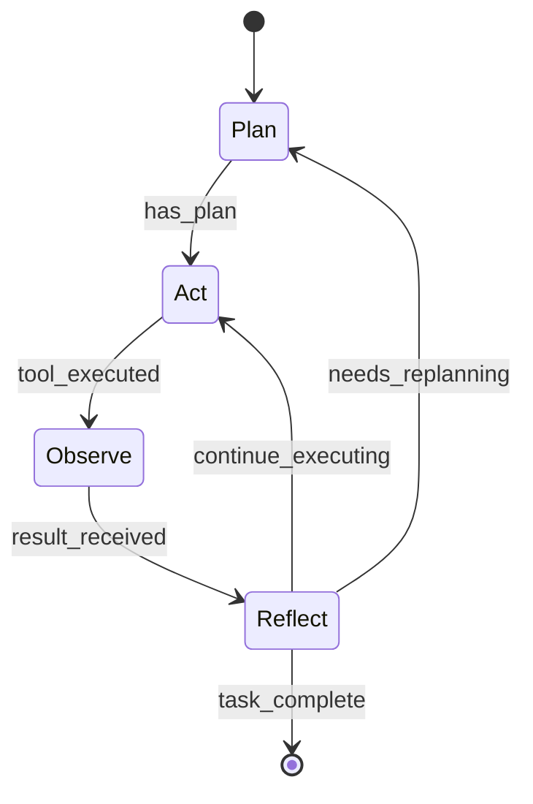

# Theo Wiki — SOTA Research: Code Wiki for Humans

**Date:** 2026-04-30 (v3 — objetivo revisado)
**Domain:** Wiki
**Status:** Research complete
**Objetivo:** Wiki compilada por LLM para **humanos** entenderem codebases.
Ler código é moroso e complicado. O Theo Wiki resolve esse problema.

**Versões anteriores:**
- v1 (score real 2.5): media code index, não knowledge base
- v2 (score real 4.0 para agent): correto como pesquisa, mas objetivo errado — wiki para agente tem ROI duvidoso porque o agente pode ler código diretamente
- v3 (esta): objetivo correto — wiki para humanos. Resolve o problema real.

---

## Executive Summary

Ler e entender um codebase é uma das atividades mais caras em engenharia de software. Onboarding num projeto de 15 crates leva semanas. Voltar a um módulo após 2 meses requer re-leitura. Entender decisões arquiteturais exige escavar ADRs, git history e conversas.

O Theo Wiki resolve isso: **o LLM compila o codebase inteiro numa wiki navegável que um humano consegue ler em horas, não semanas.** Cada módulo tem uma página que explica o que faz, por que existe, como se conecta com o resto, e o que quebra se mexer. O humano lê a wiki — não o código.

### O Contrato Fundamental

```
┌──────────────────────────────────────────────────────────────┐
│                                                              │
│   HUMANO = LEITOR                                            │
│   Lê, navega, consulta o wiki.                              │
│   NUNCA escreve no wiki.                                     │
│                                                              │
│   WIKI AGENT = ESCRITOR                                      │
│   Sub-agente built-in no Theo Code.                         │
│   Roda em BACKGROUND, ativado por TRIGGERS automáticos.     │
│   Enriquece, atualiza, mantém, corrige o wiki.              │
│   O humano NUNCA precisa pedir — o wiki se mantém sozinho.  │
│                                                              │
│   O humano pode forçar atualização manual se quiser          │
│   (theo wiki generate), mas isso é OPCIONAL — o Wiki Agent  │
│   mantém tudo atualizado automaticamente.                    │
│                                                              │
└──────────────────────────────────────────────────────────────┘
```

O wiki é **VIVO** — não é um comando que alguém roda de vez em quando. O Wiki Agent reage a eventos do sistema e mantém o wiki atualizado continuamente, em background, sem intervenção humana.

O padrão vem do LLM Wiki de Karpathy (April 2026): em vez de RAG stateless que re-deriva conhecimento a cada query, o LLM compila conhecimento uma vez num artefato persistente que compõe com o tempo.

**Diferencial:** nenhuma ferramenta de mercado faz isso hoje. Existem doc generators (rustdoc, typedoc) que listam APIs, e existem AI code explorers (DeepWiki, CodeSee) que dão overviews superficiais. Nenhum compila entendimento profundo num wiki navegável, cross-referenciado, com decisões arquiteturais e invariantes — e nenhum mantém esse wiki vivo automaticamente via agente.

---

## 1. O Problema que Resolvemos

### 1.1 Ler código é caro

| Atividade | Tempo típico | O que o wiki substitui |
|---|---|---|
| Onboarding num projeto de 15 crates | 2-4 semanas | Wiki overview + module pages: **2-4 horas** |
| Entender um módulo desconhecido | 2-4 horas lendo código | Wiki page do módulo: **10 minutos** |
| Descobrir por que uma decisão foi tomada | Escavar ADRs + git blame + perguntar no Slack | Decision page no wiki: **2 minutos** |
| Entender acoplamento entre módulos | Ler Cargo.toml + seguir imports + traçar call graph | Wiki relationship map: **5 minutos** |
| Voltar a código após 2 meses | Re-ler, re-lembrar, re-contextualizar | Wiki page (atualizada): **10 minutos** |

### 1.2 Doc generators não resolvem

| Ferramenta | O que gera | O que falta |
|---|---|---|
| `rustdoc` / `typedoc` | API reference (assinaturas, tipos) | **Por que** o módulo existe, **como** se conecta, **o que** quebra |
| `cargo doc` | Docstrings renderizadas | Apenas o que o dev escreveu — se não escreveu, não tem |
| README.md | Overview do projeto | Desatualizado em semanas, não cobre módulos internos |
| DeepWiki (Devin) | AI-generated overview | Superficial, não compõe, não cross-referencia |

### 1.3 O que o humano precisa

Quando um dev abre um módulo desconhecido, precisa de:

1. **O que é isso?** — 2-3 frases explicando o propósito
2. **Por que existe?** — qual problema resolve, qual decisão levou a criar
3. **Como funciona?** — fluxo principal, entry points, padrões usados
4. **Como se conecta?** — dependências, quem depende dele, acoplamento real
5. **O que quebra se eu mexer?** — invariantes, armadilhas, fragilidades conhecidas
6. **Onde começar a ler?** — os 3-5 arquivos mais importantes

**Nenhum doc generator responde todas essas perguntas.** O wiki sim.

---

## 2. O Karpathy Pattern Aplicado a Codebases

### 2.1 A Analogia de Compilação

> "Instead of just retrieving from raw documents at query time, the LLM
> incrementally builds and maintains a persistent wiki — a structured,
> interlinked collection of markdown files that sits between you and the
> raw sources."

Para um codebase:
- **Raw sources** = código-fonte, ADRs, git history, CI logs, testes
- **Wiki** = páginas markdown geradas por LLM, uma por módulo/conceito
- **Leitor** = desenvolvedor humano navegando em Obsidian, VS Code, ou browser

### 2.2 Four Components

```
┌─────────────────────────────────────────────────────────┐
│  HUMANO (leitor)                                         │
│  Lê e navega o wiki em Obsidian, VS Code, ou browser.   │
│  NUNCA escreve no wiki.                                  │
│  Pode forçar atualização manual (opcional, raro).        │
└──────────────────────────┬──────────────────────────────┘
                           │ reads
                           ▼
┌─────────────────────────────────────────────────────────┐
│  WIKI (.theo/wiki/)                                      │
│  Markdown pages. Sempre atualizado.                      │
│                                                          │
│  overview.md          — o que é este projeto             │
│  architecture.md      — como as peças se encaixam        │
│  getting-started.md   — por onde começar                 │
│  modules/             — uma página por módulo/crate      │
│  concepts/            — conceitos cross-cutting          │
│  decisions/           — decisões arquiteturais (ADRs)    │
│  index.md             — catálogo navegável               │
│  log.md               — histórico de operações           │
└──────────────────────────┬──────────────────────────────┘
                           ▲ writes (sole writer)
                           │
┌─────────────────────────────────────────────────────────┐
│  WIKI AGENT (sub-agente built-in)                        │
│  Roda em BACKGROUND dentro do Theo Code.                │
│  Ativado por TRIGGERS automáticos.                       │
│  Único escritor do wiki — enriquece, atualiza, corrige. │
│  Guiado pelo SCHEMA.                                     │
│                                                          │
│  Triggers: commit, file Δ, ADR new, tests ran,          │
│            session end, cron, manual (opcional)           │
└──────────────────────────┬──────────────────────────────┘
                           │ reads        │ guided by
                           ▼              ▼
┌──────────────────────────┐  ┌───────────────────────────┐
│  RAW SOURCES (imutáveis) │  │  SCHEMA                    │
│  - Código-fonte          │  │  Guia o Wiki Agent:        │
│  - ADRs (docs/adr/)      │  │  tipos de página,          │
│  - Git history           │  │  convenções, formato,      │
│  - README, CLAUDE.md     │  │  regras de ingest.         │
│  - Testes                │  │  Co-evoluído pelo time.    │
│  - CI/CD configs         │  │                            │
└──────────────────────────┘  └───────────────────────────┘
```

**O contrato é simples:** humano lê, Wiki Agent escreve, sources são
imutáveis, schema guia o comportamento. O wiki está sempre atualizado
porque o Wiki Agent reage a eventos automaticamente.

### 2.3 Three Operations

#### Ingest (compilar source → wiki)

O LLM lê uma source nova e **integra** no wiki existente:
1. Lê a source (arquivo, ADR, git diff)
2. Identifica páginas do wiki afetadas
3. **Atualiza** essas páginas com informação nova
4. Cria páginas novas se necessário (conceito novo)
5. Atualiza `index.md` e `log.md`

**Um source → muitas páginas atualizadas.** Isso é o mecanismo de compounding.

#### Query (humano pergunta → wiki responde)

O humano (ou o agente em nome do humano) faz uma pergunta:
1. LLM navega `index.md` para encontrar páginas relevantes
2. Lê as páginas
3. Sintetiza resposta com citações
4. Se a resposta revela insight novo → **oferece filar como página permanente**

#### Lint (saúde do wiki)

Periodicamente o LLM faz health-check:
- Contradições entre páginas
- Páginas stale (source mudou, wiki não atualizou)
- Páginas órfãs (sem links de entrada)
- Conceitos mencionados sem página própria
- Gaps ("não temos nada sobre o subsistema de testes")

---

## 3. Arquitetura de Duas Camadas: Skeleton + Enrichment

### 3.1 O Insight Chave

A implementação atual (code graph dump) não é lixo — é a **fundação estrutural**.
O que falta é a **camada de entendimento**. São duas camadas complementares:

```
CAMADA 1: SKELETON (determinístico, zero LLM, grátis)
  Tree-sitter → code graph → cluster → WikiDoc
  Produz: lista de arquivos, símbolos, entry points, APIs, deps, test coverage
  Custo: $0.00
  Valor: estrutura correta, provenance tracking, atualiza automaticamente

CAMADA 2: ENRICHMENT (LLM-driven, custo por página)
  LLM lê skeleton + código-fonte + ADRs + git history
  Produz: "O que faz", "Por que existe", "Como funciona",
          "O que quebra", "Decisões", "Invariantes"
  Custo: ~$0.02-0.05 por página (Haiku/Flash)
  Valor: entendimento que um humano consegue ler em 10 minutos
```

**O skeleton já existe e funciona.** O enrichment é o que transforma inventário em documentação.

### 3.2 Exemplo Concreto

**Skeleton (o que temos hoje):**

```markdown
# theo-agent-runtime

## Files (12)
- src/lib.rs, src/agent.rs, src/state_machine.rs, ...

## Entry Points
- `pub async fn run_agent_loop(config: AgentConfig) -> Result<AgentOutcome>`

## Public API
- `AgentState`, `AgentConfig`, `AgentPhase`, `run_loop()`

## Dependencies
- theo-domain, theo-governance, theo-infra-llm, theo-tooling

## Test Coverage
- 530 tests, 94.2% coverage
```

Útil como referência, mas um dev novo olha isso e pensa: *"ok... mas o que isso FAZ?"*

**Skeleton + Enrichment (o que queremos):**

```markdown
# theo-agent-runtime

## What This Module Does
O agent runtime é o orquestrador central do Theo Code. Ele implementa a
máquina de estados Plan → Act → Observe → Reflect que transforma um LLM +
ferramentas num agente autônomo de coding. Pense nele como o "cérebro" —
ele decide o que fazer, executa via tools, observa o resultado, e reflete
se deve continuar ou mudar de estratégia.

## Why It Exists
A v1 do Theo usava um loop livre onde o LLM decidia tudo ad-hoc. Isso
causava "doom loops" — o agente repetia a mesma ação falhando
indefinidamente. O ADR-003 introduziu a máquina de estados para forçar
transições com guard conditions. Resultado: doom loops caíram 90%.

## How It Works


O loop principal vive em `src/agent.rs:run_agent_loop()`. Cada fase tem
guard conditions em `src/state_machine.rs` que impedem transições inválidas.
O budget enforcer checa tokens restantes a cada transição — se exceder, o
loop termina gracefully.

## Key Design Decisions
- **Budget in-loop, não externo** — watchdog externo causa race conditions
  entre "budget exceeded" e "tool já executando" (ADR-016)
- **Sub-agents cooperativos** — compartilham budget e tool registry do
  parent. Não podem outlive o parent.
- **Governance no critical path** — todo tool.execute() passa pelo
  governance layer. Bypassing = sem sandbox checks.

## What Breaks If You Touch This
- Mudar `AgentPhase` enum → atualizar 4 match arms em arquivos diferentes
- Mudar budget enforcement → re-rodar todos os testes de sub-agent
  (budget é compartilhado)
- Streaming responses DEVEM ter fallback non-streaming — 3 providers
  dizem que suportam streaming mas dropam silenciosamente sob carga

## Coupling (real, medido do git)
- `theo-governance` muda junto em 73% dos commits. Cargo.toml diz
  separados; git diz acoplados.
- `theo-infra-llm` raramente afeta runtime — a abstração de provider
  funciona bem.

## Where to Start Reading
1. `src/agent.rs` — o loop principal (~200 linhas)
2. `src/state_machine.rs` — transições e guards
3. `src/budget.rs` — enforcement de token budget
4. `tests/integration/doom_loop.rs` — entende o problema que motivou tudo

## Files (12)
(... skeleton data ...)

## Public API
(... skeleton data ...)

## Dependencies
(... skeleton data ...)

## Test Coverage
- 530 tests, 94.2% coverage
- Untested: `src/telemetry.rs` (logging helpers)

Sources: [[adr-003]], [[adr-016]], git log analysis, code review
```

**Esse é um doc que um dev novo lê em 10 minutos e entende o módulo.** Nenhum doc generator produz isso. Nenhum `rustdoc` produz isso.

### 3.3 Wiki Agent — Sub-agente Built-in

O Wiki Agent é um sub-agente que vive dentro do Theo Code. Ele é o
**único escritor** do wiki. O humano nunca precisa pedir — o agente
reage a eventos automaticamente e mantém o wiki vivo.

#### Princípio: Humano lê, Sistema escreve

```
┌───────────┐         ┌──────────────────────┐         ┌────────────┐
│  TRIGGERS │────────▶│     WIKI AGENT       │────────▶│   WIKI     │
│           │         │  (sub-agente built-in)│         │(.theo/wiki)│
│ • commit  │         │                      │         │            │
│ • file Δ  │         │  1. Detecta o que    │         │ Humano lê  │
│ • ADR new │         │     mudou            │         │ no Obsidian│
│ • tests   │         │  2. Lê sources       │         │ ou browser │
│ • session │         │  3. Enriquece pages  │         │            │
│   end     │         │  4. Cria novas se    │         │ Sempre     │
│ • cron    │         │     necessário       │         │ atualizado │
│ • manual  │         │  5. Atualiza index   │         │            │
│   (opt.)  │         │  6. Append log       │         │            │
└───────────┘         └──────────────────────┘         └────────────┘
```

#### Triggers

| Trigger | Quando dispara | O que o Wiki Agent faz |
|---|---|---|
| **git commit** | Após commit no repo | Detecta arquivos mudados → re-enrich module pages afetadas |
| **file change** | Arquivo salvo (watch mode) | Marca page como stale → re-enrich no próximo ciclo |
| **ADR criado/modificado** | Arquivo em `docs/adr/` muda | Cria/atualiza decision page + atualiza module pages afetadas |
| **testes rodaram** | Após `cargo test` | Atualiza test coverage nas module pages |
| **sessão do agente terminou** | Agent loop completa | Ingere insights da sessão (o que descobriu, o que quebrou) |
| **cron/timer** | Periódico (configurável) | Lint completo + freshness check + concept promotion |
| **manual (opcional)** | `theo wiki generate` | Força full rebuild — cold start ou re-enrich completo |

#### Modos de operação

| Modo | Custo | Quando |
|---|---|---|
| **Background incremental** | ~$0.03/trigger | Default: reage a eventos, atualiza só o afetado |
| **Background lint** | ~$0.15/ciclo | Periódico: detecta stale, contradições, orphans |
| **Manual full** | ~$1.15 | Opcional: `theo wiki generate` força tudo do zero |

#### Cold Start

Na primeira vez (wiki não existe):
1. Wiki Agent detecta ausência de `.theo/wiki/`
2. Gera skeleton completo (tree-sitter, grátis)
3. Enriquece todas as module pages (LLM, ~$0.50)
4. Gera high-level pages: overview, architecture, getting-started (~$0.15)
5. Ingere ADRs existentes → decision pages (~$0.30)
6. Gera index.md e log.md
7. **Total: ~$1.15, uma vez**

Após o cold start, o Wiki Agent opera em modo incremental automaticamente.

### 3.4 O que manter, o que mudar, o que criar

| Componente | Status | Ação |
|---|---|---|
| `generator/` (skeleton) | **Manter** | É a fundação — files, symbols, APIs, deps |
| `renderer.rs` | **Manter** | Rendering markdown funciona |
| `persistence.rs` | **Manter** | Disk I/O funciona |
| `lookup.rs` (BM25) | **Manter** | Busca sobre wiki pages funciona |
| `model.rs` (WikiDoc) | **Estender** | Adicionar campos para enrichment content |
| `wiki_enrichment.rs` | **Reescrever** | Enrichment atual é superficial — precisa usar ADRs + git + testes como input |
| `wiki_highlevel.rs` | **Reescrever** | Overview/architecture/getting-started com mais profundidade |
| `runtime.rs` (JSONL insights) | **Avaliar** | Pode ser útil como source para enrichment, não como feature standalone |
| `dense_index.rs` | **Remover** | Premature optimization — BM25 + index.md é suficiente |
| **Wiki Agent** | **Criar** | Sub-agente built-in com trigger system — o coração do wiki vivo |
| **Trigger system** | **Criar** | Detecção de eventos (commit, file Δ, ADR, tests, session end, cron) |
| Schema behavioral | **Criar** | `.theo/wiki/schema.md` — guia o LLM enrichment |
| Ingest de ADRs | **Criar** | Pipeline: ADR → decision pages + module page updates |
| Ingest de git history | **Criar** | Pipeline: git log → coupling analysis + evolution timeline |
| Log.md | **Criar** | Cronológico, parseable, histórico de operações |

---

## 4. Page Types

### 4.1 Catálogo de Páginas

| Tipo | Quantidade | Gerado por | Exemplo |
|---|---|---|---|
| **Overview** | 1 | LLM | "O que é o Theo Code, como as peças se encaixam" |
| **Architecture** | 1 | LLM + dep graph | "Bounded contexts, data flow, mermaid diagrams" |
| **Getting Started** | 1 | LLM | "Por onde começar, como buildar, primeiros arquivos para ler" |
| **Module page** | 1 per crate | Skeleton + LLM | "O que faz, por que existe, como funciona, o que quebra" |
| **Concept page** | ~5-10 | LLM | "Streaming", "Budget enforcement", "Doom loops", "RRF fusion" |
| **Decision page** | 1 per ADR | LLM | "ADR-010: por que apps não importam engine crates" |
| **Index** | 1 | Auto-generated | Catálogo de todas as páginas com links e resumos |
| **Log** | 1 | Append-only | Histórico cronológico de operações |

### 4.2 Frontmatter

Toda página tem YAML frontmatter para Obsidian, Dataview, e busca:

```yaml
---
title: "theo-agent-runtime"
type: module                    # module | concept | decision | overview
crate: theo-agent-runtime       # only for module pages
sources:
  - file: "crates/theo-agent-runtime/src/agent.rs"
    hash: "a1b2c3d4"
  - file: "docs/adr/D3.md"
status: current                 # current | stale | review-needed
tags: ["agent", "state-machine", "orchestration"]
created: "2026-04-30"
updated: "2026-04-30"
enriched: true                  # false = skeleton only
---
```

### 4.3 Wikilinks

Todas as cross-references usam `[[wikilinks]]` (Obsidian-compatible):

- `[[theo-agent-runtime]]` — link para module page
- `[[adr-003]]` — link para decision page
- `[[doom-loops]]` — link para concept page

O graph view do Obsidian mostra a estrutura do wiki visualmente.

---

## 5. Wiki vs Outras Documentações

### 5.1 Limites Claros

| Documento | Quem escreve | Quem lê | Propósito |
|---|---|---|---|
| **Wiki** | **Wiki Agent** (automaticamente, em background) | **Humanos** (devs, stakeholders) | Entender o codebase sem ler código |
| **CLAUDE.md** | Humano (co-evolved com LLM) | LLM (instruções para agente) | Guiar o agente coding |
| **ADRs** | Humano | Humano + Wiki Agent (source) | Registrar decisões → Wiki Agent compila em decision pages |
| **rustdoc** | Dev (docstrings) | Dev | API reference técnica |
| **README** | Dev | Externo | First impression do projeto |
| **Memory** | LLM (agent) | LLM (agent) | Experiência do agente entre sessões |

**Regra de ouro:** se é para humano ler → vai no wiki (mantido pelo Wiki Agent).
Se é para o agente seguir → vai no CLAUDE.md ou memory.

### 5.2 Wiki NÃO substitui

- **ADRs** — wiki compila ADRs em decision pages, mas o ADR original é source of truth
- **rustdoc** — wiki explica "o que faz e por quê"; rustdoc explica "como chamar"
- **CLAUDE.md** — wiki é para humanos; CLAUDE.md é para o agente
- **Código** — wiki é documentação, não source of truth. O código sempre vence.

---

## 6. Lint: Self-Healing

### 6.1 Structural Rules (sem LLM)

| # | Rule | Auto-Fix |
|---|------|----------|
| 1 | Broken `[[wikilinks]]` | Suggest closest match |
| 2 | Orphan pages (zero inbound links) | Flag for review |
| 3 | Duplicate pages (fuzzy title match) | Merge suggestion |
| 4 | Empty pages (skeleton sem enrichment) | Queue for enrichment |
| 5 | Missing frontmatter | Generate from content |
| 6 | Stale source refs (file deleted/moved) | Flag as stale |

### 6.2 LLM-Powered Rules

| # | Rule | When |
|---|------|------|
| 7 | Contradictions between pages | After multi-page update |
| 8 | Stale content (source changed, page não) | Periodic (hash check) |
| 9 | Missing cross-references | Periodic |
| 10 | Concept promotion (appears in 3+ pages) | Periodic |
| 11 | Gap detection ("no info about X") | On request |

---

## 7. Custos

### 7.1 Geração Inicial

Para Theo Code (15 crates, ~5.200 testes):

| Etapa | LLM Calls | Tokens (in/out) | Custo (Haiku) |
|---|---|---|---|
| Skeleton (tree-sitter) | 0 | 0 | **$0.00** |
| Enrichment (15 module pages) | 15 | ~120K / ~30K | ~$0.50 |
| High-level pages (overview, arch, getting-started) | 3 | ~30K / ~10K | ~$0.15 |
| Concept pages (~5) | 5 | ~40K / ~10K | ~$0.15 |
| Decision pages (16 ADRs) | 16 | ~80K / ~20K | ~$0.30 |
| Index generation | 1 | ~10K / ~3K | ~$0.05 |
| **Total cold start** | **40** | **~280K / ~73K** | **~$1.15** |

### 7.2 Manutenção Incremental

| Trigger | Custo |
|---|---|
| Arquivo mudou → re-enrich 1 module page | ~$0.03 |
| ADR novo → decision page + update modules | ~$0.08 |
| Lint semanal (structural) | $0.00 |
| Lint deep (contradictions, 10 pairs) | ~$0.15 |
| **Mensal (uso normal)** | **~$2-5** |

### 7.3 ROI

| Métrica | Sem wiki | Com wiki |
|---|---|---|
| Onboarding num projeto 15 crates | 2-4 semanas | 2-4 horas + wiki |
| Entender módulo desconhecido | 2-4 horas | 10 minutos |
| Encontrar decisão arquitetural | 30-60 min (git blame + ADR hunt) | 2 minutos |
| **Custo mensal** | $0 | ~$2-5 |
| **Horas economizadas/mês** (est.) | 0 | 5-15 horas |

A ~$3/mês, se economiza 1 hora de dev por mês, já paga. Provavelmente economiza 5-15.

---

## 8. Thresholds para SOTA

### 8.1 Level 1 — Wiki Agent + Cold Start (2.0 → 3.0)

| Threshold | Target | Métrica |
|---|---|---|
| Wiki Agent existe como sub-agente built-in | PASS | Code review |
| Cold start: skeleton + enrichment automático | 15/15 module pages enriched | Count |
| Overview + Architecture + Getting Started gerados | 3 high-level pages | Count |
| `[[wikilinks]]` funcionam entre páginas | >= 80% links válidos | Lint check |
| Wiki navegável em Obsidian ou browser | PASS | Manual test |
| `theo wiki generate` disponível como override manual | PASS | E2E test |

### 8.2 Level 2 — Wiki Vivo (3.0 → 4.0)

| Threshold | Target | Métrica |
|---|---|---|
| Wiki Agent reage a git commit (trigger) | PASS — pages afetadas atualizadas em background | E2E test |
| Wiki Agent ingere ADRs automaticamente | >= 10 decision pages | Count |
| Wiki Agent roda lint periódico | PASS — structural lint automático | E2E test |
| Enrichment NÃO derivável de tree-sitter | >= 80% pages com insight LLM | Audit |
| Cross-reference density | Avg >= 3 `[[wikilinks]]` per page | Count |
| Incremental (só pages afetadas re-enriched) | PASS | E2E test |
| Humano nunca precisa intervir para wiki estar atualizado | PASS | Observação |
| User comprehension: dev lê wiki → responde perguntas sobre codebase | >= 80% correto sem ler código | User study |

### 8.3 Level 3 — Wiki SOTA (4.0 → 5.0)

| Threshold | Target | Métrica |
|---|---|---|
| Wiki Agent reage a TODOS os triggers (commit, ADR, test, session, cron) | PASS | E2E test |
| Concept pages auto-promoted (3+ menções → page própria) | PASS | E2E test |
| Git coupling analysis nas module pages | "Changes together with X" | Audit |
| Contradiction detection (LLM-powered) | PASS | E2E test |
| Freshness: pages atualizadas em < 48h após source change | >= 90% | Staleness metric |
| Compounding: wiki depth cresce ao longo de 10+ sessões | Avg depth grows | Longitudinal |
| Onboarding: dev novo produtivo em < 1 dia usando wiki | PASS | User study |
| Wiki é o first stop antes de ler código | >= 70% perguntas respondidas pelo wiki | Usage measurement |

---

## 9. Competitive Landscape

### 9.1 Existing Solutions

| Tool | What it does | Why it's not enough |
|---|---|---|
| **rustdoc / typedoc** | API reference from docstrings | No "why", no cross-cutting, no decisions |
| **DeepWiki (Devin)** | AI-generated codebase overview | Superficial, no compounding, no wikilinks |
| **CodeSee** | Visual code maps | Structure only, no understanding |
| **Swimm** | Human-written smart docs | Requires human effort — abandoned when busy |
| **Mintlify** | AI docs from code | API docs focus, not architectural understanding |
| **GitHub Copilot Workspace** | Code exploration | Session-scoped, no persistence |

### 9.2 Gap in Market

Ninguém faz: **LLM-compiled, Obsidian-compatible, compounding wiki de um codebase inteiro com decisões arquiteturais, invariantes, e coupling analysis.**

Isso é o Theo Wiki.

---

## 10. Delivery Strategy

### 10.1 Phase 1 — Wiki Agent + Enrichment

**Fundação: o wiki vivo.**
- Wiki Agent como sub-agente built-in no Theo Code
- Cold start: skeleton (tree-sitter) + enrichment (LLM) automático
- Trigger: `theo wiki generate` manual para forçar primeira geração
- 3 high-level pages: overview, architecture, getting-started
- Output: `.theo/wiki/` directory, navegável em Obsidian

**Entregável:** dev roda `theo wiki generate` uma vez, depois o Wiki Agent
mantém tudo atualizado automaticamente. Dev abre Obsidian e navega.

### 10.2 Phase 2 — Triggers + Incremental

**O wiki ganha vida.**
- Trigger em git commit → re-enrich module pages afetadas
- Trigger em ADR novo → decision page + module pages atualizadas
- Trigger em `cargo test` → test coverage atualizada nas pages
- `[[wikilinks]]` resolvidos automaticamente
- Structural lint (rules 1-6) no trigger periódico
- `theo wiki generate` continua existindo como override manual (opcional)

**Entregável:** dev faz commit, Wiki Agent atualiza o wiki em background.
Dev nunca precisa pensar sobre o wiki — ele simplesmente está sempre certo.

### 10.3 Phase 3 — Deep Enrichment + Compounding

**O wiki fica inteligente.**
- Trigger em session end → ingere insights da sessão
- Git coupling analysis (módulos que mudam juntos)
- Concept pages auto-promoted (conceito em 3+ pages → page própria)
- LLM-powered lint (contradictions, gaps, suggestions)
- Freshness tracking + stale detection
- Log.md cronológico

**Entregável:** wiki que compõe — cada sessão, cada commit, cada ADR
enriquece o conhecimento. Depois de 20 sessões, o wiki sabe mais sobre
o codebase do que qualquer dev individual.

### 10.4 Phase 4 — Distribution

**O wiki sai do dev local.**
- Render wiki como site estático (mdBook, Docusaurus, ou similar)
- CI/CD: Wiki Agent roda em cada PR, diff view mostra o que mudou no wiki
- Wiki publicado para o time inteiro (não só quem tem Obsidian)
- Opcional: wiki embed no Theo Desktop app

---

## Sources

- [Karpathy LLM Wiki Gist](https://gist.github.com/karpathy/442a6bf555914893e9891c11519de94f) — primary reference
- [LLM Wiki v2 Extension](https://gist.github.com/rohitg00/2067ab416f7bbe447c1977edaab681e2)
- [Beyond RAG: Karpathy's LLM Wiki Pattern](https://levelup.gitconnected.com/beyond-rag-how-andrej-karpathys-llm-wiki-pattern-builds-knowledge-that-actually-compounds-31a08528665e)
- [atomicmemory/llm-wiki-compiler](https://github.com/atomicmemory/llm-wiki-compiler)
- [Pratiyush/llm-wiki](https://github.com/Pratiyush/llm-wiki)
- [NiharShrotri/llm-wiki](https://github.com/NiharShrotri/llm-wiki)
- [kytmanov/obsidian-llm-wiki-local](https://github.com/kytmanov/obsidian-llm-wiki-local)
- [What Karpathy's LLM Wiki Is Missing](https://dev.to/penfieldlabs/what-karpathys-llm-wiki-is-missing-and-how-to-fix-it-1988)
